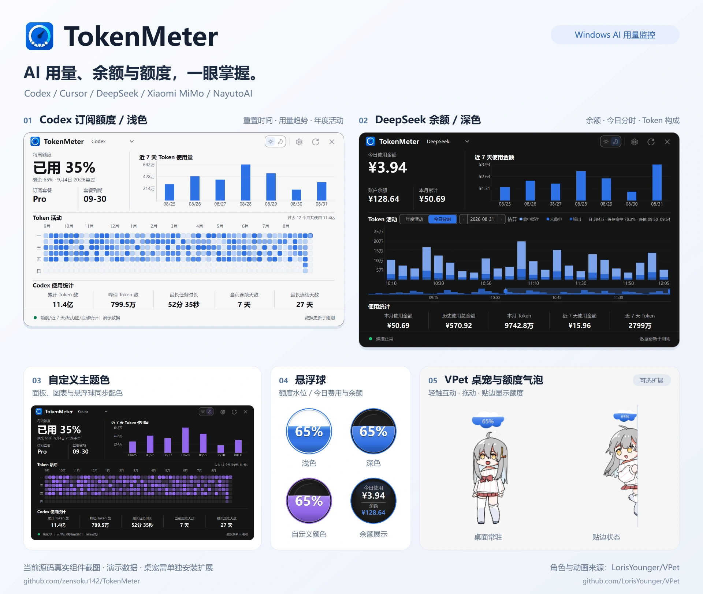

<p align="center">
  <a href="./README.md">简体中文</a> |
  <a href="./README.en.md">English</a> |
  <a href="./README.zh-TW.md">繁體中文</a> |
  <a href="./README.ja.md">日本語</a> |
  <a href="./README.ko.md">한국어</a>
</p>

# TokenMeter — Windows AI Token Usage & Subscription Quota Monitor

<p align="center">
  <a href="https://github.com/zensoku142/TokenMeter/stargazers"></a>
  <a href="https://github.com/zensoku142/TokenMeter/releases/latest"></a>
  <a href="https://github.com/zensoku142/TokenMeter/releases"></a>
  <a href="https://github.com/zensoku142/TokenMeter/actions/workflows/ci.yml"></a>
</p>

<p align="center">
  <a href="https://github.com/zensoku142/TokenMeter/releases/latest"><strong>Download latest</strong></a> ·
  <a href="https://github.com/zensoku142/TokenMeter/stargazers">Star the project</a> ·
  <a href="https://github.com/zensoku142/TokenMeter/discussions">Feedback & discussions</a>
</p>

<p align="center">
  <strong>AI Token Usage, Cost & Balance Monitor for Windows</strong><br>
  <sub>Track Codex, Cursor, DeepSeek, Xiaomi MiMo, and NayutoAI from a lightweight desktop floating widget.</sub>
</p>

<p align="center">
  <a href="docs/images/readme-hero.webp"></a>
</p>

Actual component screenshots in Chinese, using demo data. [Original images and sources](docs/images/readme/README.md).

TokenMeter is a lightweight AI token usage and subscription quota monitor for Windows 10/11. Track used and remaining Codex and Cursor quotas and reset times, plus DeepSeek, Xiaomi MiMo, and NayutoAI token usage, API costs, account balances, and historical trends.

## Features

- **Subscription quotas**: used and remaining percentages and reset times for Codex / Cursor; Codex also shows seven-day tokens, annual activity, and usage statistics.
- **API usage**: costs and balances, today's intraday chart, token breakdowns, and historical trends for DeepSeek / MiMo / NayutoAI.
- **Floating display**: a quota water-level widget or balance display, with dragging, mouse-wheel resizing, edge hiding, and a system tray icon.
- **Appearance and languages**: light, dark, and system themes, custom colors and opacity; Simplified Chinese, Traditional Chinese, English, Japanese, and Korean.
- **Collection and caching**: refresh only the current provider by default, with optional background providers; offline caching, DeepSeek peak-pricing hints, and MiMo Cookie collection and renewal.
- **Desktop integration**: launch at sign-in, automatic updates, data-directory migration, and an optional VPet extension.

## Installation and setup

Requires Windows 10 / 11 and at least one supported account.

1. Download and run `TokenMeter-Setup-vX.Y.Z-x64.exe` from [GitHub Releases](https://github.com/zensoku142/TokenMeter/releases/latest). Checksums are in `SHA256SUMS.txt`.
2. Click the floating widget and select a provider in Settings. Codex / Cursor can read local login data; enter DeepSeek credentials or an optional API key, use MiMo's Cookie collection, or enter NayutoAI credentials.
3. Settings save automatically; the default refresh interval is 60 seconds. Appearance contains theme and language options; Floating & Startup contains launch and edge behavior.

> Data depends on platform endpoints and login state. API or risk-control changes may interrupt collection. Use only your own credentials.

## VPet desktop pet (optional)

The main installer does not include the pet. Download it in Settings → Pet, then enable it after installation completes; no separate .NET installation is needed. The pet replaces the floating widget. Disabling or uninstalling it restores the widget without affecting accounts or the panel.

- Touch interactions, dragging, resizing, autonomous activity, and an edge quota bubble. Double-click the bubble to open the usage panel.
- The context menu controls bubble visibility and optional water / break reminders, which are off by default. The pet's menu is currently in Chinese.
- The lite extension omits feeding, work, progression, Steam, and online features. It updates independently and exits with the main app.

See [pet development](pet_host/README.md) for implementation and build details, and read the [source and licensing notices](pet_host/THIRD_PARTY_NOTICES.md) before reusing assets.

## Data, privacy, and updates

- Data defaults to `install directory\data` and can be moved in Settings. Legacy migration copies data and preserves the original directory; history is cached in local SQLite.
- API keys, Bearer tokens, and Cookies are stored in Windows Credential Manager, not configuration files or logs. The pet receives display fields only, never credentials.
- Updates verify SHA256 and preserve data and shortcuts. Uninstall also keeps `data`; remove it manually only when no longer needed. A checksum is not a release signature.

## Run from source

Requires Python 3.11+. Source and installed builds share a single-instance limit; exit any running TokenMeter first.

```powershell
git clone https://github.com/zensoku142/TokenMeter.git
cd TokenMeter
python -m venv .venv
.\.venv\Scripts\Activate.ps1
python -m pip install --upgrade "pip>=26.1.2"
python -m pip install -r requirements.txt
python main.py
```

<details>
<summary>Development, tests, and builds</summary>

```powershell
python -m pip install -r requirements-dev.txt
python -m pytest -q
python -m ruff check .
pyright
python -m pip install -r requirements-build.txt
python scripts/build_release.py
```

Qt tests need an available Windows desktop session; installer builds require Inno Setup. Pet builds require .NET SDK 8+; see [pet development](pet_host/README.md).

[Project structure](docs/PROJECT_STRUCTURE.md) · [Example configuration](examples/config.example.py) (do not copy it to `config.py`)

</details>

## Troubleshooting

- No window: check the system tray and avoid starting a second instance.
- Expired credentials or rate limits: renew the login / Cookie, or wait before refreshing.
- Data problems: inspect `TokenSpider.log` in the active data directory; remove sensitive information before reporting an issue.

## Versions

Main app: `1.15.1`; optional pet extension: `0.2.0`. See [GitHub Releases](https://github.com/zensoku142/TokenMeter/releases) for changes and checksums.

## License and acknowledgments

TokenMeter's own code uses the [MIT License](LICENSE).

The pet core, default character, and animations come from [LorisYounger/VPet](https://github.com/LorisYounger/VPet). Thanks to its authors and contributors. The core uses [Apache-2.0](third_party/VPet/LICENSE); the character and animations are copyrighted by 虚拟主播模拟器制作组 and have separate terms, outside TokenMeter's MIT license. See the [third-party notices](pet_host/THIRD_PARTY_NOTICES.md).
