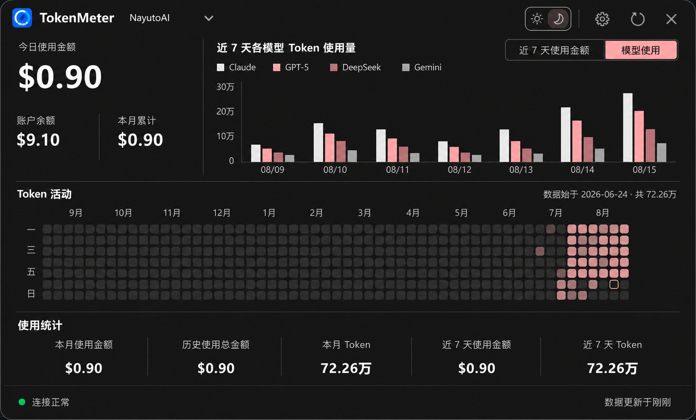
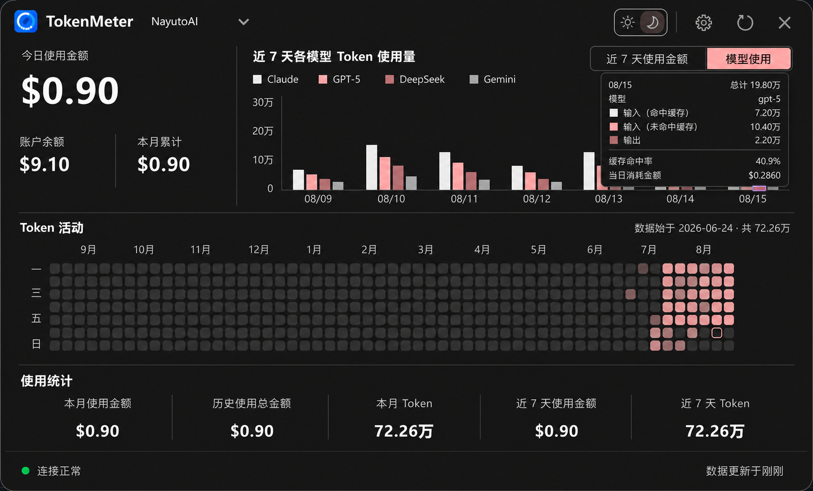
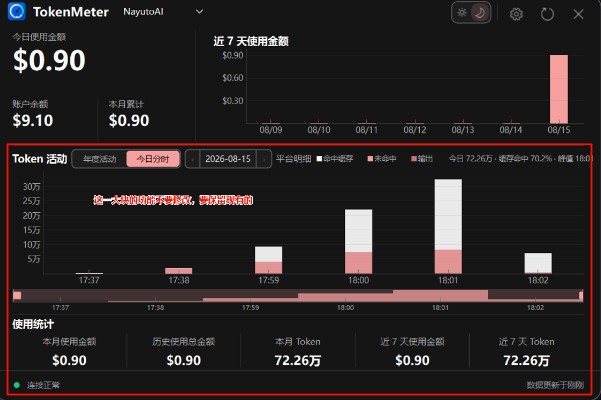
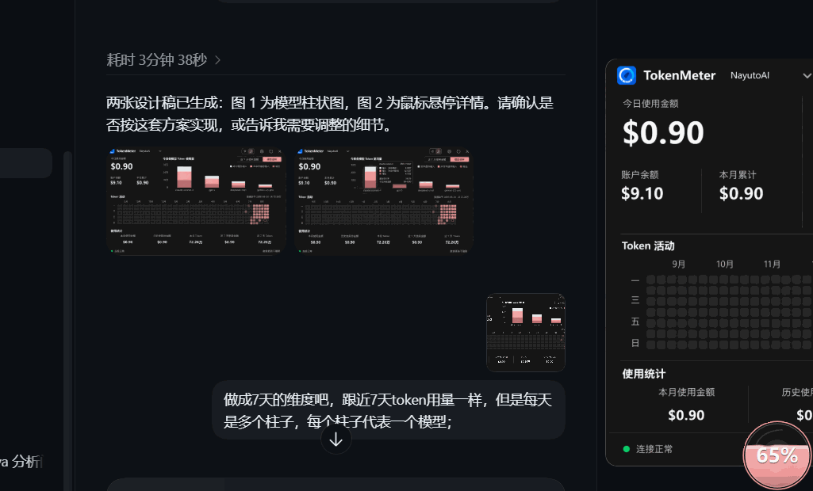

# NayutoAI 近 7 天模型用量、分时模型名称与 Tooltip 修复需求

## 1. 文档目的

本文档是现有 NayutoAI 接入的增量实现交接，不重新实现中转 Provider，也不重新设计 TokenMeter。

本次只完成以下三组需求：

1. 在主面板顶部现有“近 7 天使用金额”区域内增加“模型使用”切换视图。
2. NayutoAI“今日分时”详情增加模型名称，并在日期切换、聚合间隔和重启后仍然可靠。
3. 修复顶部近 7 天图表中两套 Tooltip 争用 Qt 全局 `QToolTip` 导致的闪烁。

本文档描述的是待实现内容。创建本文档时没有实现上述功能，也没有修改现有 Provider、UI、数据库或测试代码。

## 2. 实施前必须阅读

新会话开始编码前必须完整阅读：

1. `AGENTS.md`
2. `docs/relay-provider-integration-requirements.md`
3. `docs/relay-provider-verified-interface-notes.md`
4. `docs/relay-provider-implementation-prompt-v2.md`
5. 本文档
6. `C:\Users\Administrator\Desktop\中转请求和响应参数.txt`

附件中的旧 Bearer 已视为泄露，只能读取字段和响应结构，禁止输出、复制、保存或复用凭证。

开始前还必须执行 `git status`。当前工作区包含 NayutoAI 接入和其他用户未提交、未跟踪内容，不得执行 `git reset --hard`、`git checkout --`、清理未跟踪文件或覆盖用户改动。

## 3. 视觉参考

### 3.1 近 7 天模型图正常状态



文件：`docs/relay-provider-mockups/nayuto-model-usage-7d-normal.png`

### 3.2 近 7 天模型图悬停状态



文件：`docs/relay-provider-mockups/nayuto-model-usage-7d-hover.png`

### 3.3 必须保留的 Token 活动和底部布局



文件：`docs/relay-provider-mockups/nayuto-token-activity-preserve.png`

### 3.4 Tooltip 闪烁复现



文件：`docs/relay-provider-mockups/trend-tooltip-flicker.gif`

效果稿只定义信息结构和交互目标，实际尺寸、颜色、字体、主题和控件边界以现有 PySide6 组件为准。

## 4. 已确认的当前实现

### 4.1 日模型数据已经存在

`api/providers/nayuto.py` 的 `_normalize_records()` 已按以下维度构造日用量：

```text
日期 -> 模型 -> Token 类型/金额
```

已有字段映射：

- `model`：模型名称。
- `cache_read_tokens`：输入（命中缓存）。
- `input_tokens`：输入（未命中缓存）。
- `output_tokens`：输出。
- `actual_cost`：实际支付金额。

`data/history.py` 的 `daily_usage` 已使用以下主键保存日模型数据：

```text
(usage_date, model, token_type, provider)
```

因此近 7 天模型图应读取现有 `daily_usage`，不应重新抓接口、不应使用本地价格公式，也不需要为日模型图修改现有表主键。

### 4.2 当前 UI 只拿到按日总计

`history.recent_daily()` 会把所有模型合并为每天的 `tokens` 和 `cost_cny`，`TokenData.daily_usage` 因而不含模型维度。

顶部 `TrendCard` 当前只有单序列的“近 7 天使用金额/Token”图；要展示每天多个模型，需要从历史层增加统一的“近 7 天按日按模型”展示数据，UI 不得直接查询 SQLite 或解析 NayutoAI JSON。

### 4.3 分钟聚合当前丢失模型

NayutoAI `_normalize_records()` 当前按以下键生成分钟 Token：

```text
(usage_date, minute, token_type)
```

金额按以下键生成：

```text
(usage_date, minute)
```

`ExactMinuteUsage`、`minute_usage`、`minute_cost_usage` 和 `TokenData.minute_usage*` 都没有模型字段。因此只改 Tooltip 文案无法可靠得到模型名称，也无法支持：

- 历史日期切换；
- 1～60 分钟聚合间隔；
- 程序重启后的历史分时；
- 同一分钟多个模型；
- 请求失败时继续显示最后成功缓存。

### 4.4 Tooltip 闪烁根因已确认

`TrendCard._on_mouse_moved()` 使用 `QToolTip.showText()` 手动显示柱子详情；`MainPanel.update_data()` 又对同一个 `trend.plot` 调用 `setToolTip()`，缓存状态的文案是：

```text
当前显示最近一次缓存的近 7 天数据
```

Qt 的原生 Tooltip 事件与手动 `QToolTip.showText()` 争用同一个全局提示框，鼠标移动时会在“柱子详情”和“缓存来源文案”之间交替显示，形成闪烁。数据缓存本身没有反复变化。

## 5. 需求一：近 7 天模型使用图

### 5.1 放置位置和切换

- 只改主面板顶部现有 `TrendCard` 区域。
- 保留现有“近 7 天使用金额”视图。
- NayutoAI 增加同一区域内的“模型使用”切换项。
- 切换只替换顶部图表内容，不增加新行、不扩大窗口、不改变面板高度。
- 为兼容现有使用习惯，首次进入仍默认现有“近 7 天使用金额”；用户切换后可在本次面板生命周期内保留选择。
- 小米、DeepSeek、Codex、Cursor 和其他不支持按模型日明细的 Provider 不显示该切换，顶部趋势保持原行为。

### 5.2 时间维度

- 固定显示包含今天在内的最近 7 个自然日：`today - 6 days` 到 `today`。
- 不是自然周，不按周一截断。
- 横轴始终有 7 个日期组；某天无某模型数据时该模型柱为 0，不把其他日期的柱子移位。
- 日期和当前 Provider 的已确认时区一致；NayutoAI 使用 `Asia/Shanghai`。

### 5.3 柱状图规则

- 每天是一组柱子。
- 每组中每根柱子代表一个模型。
- 每根柱子的高度是该日期、该模型的总 Token：

```text
总 Token = 命中缓存输入 + 未命中缓存输入 + 输出
```

- 模型柱不是 Token 类型堆叠柱；Token 构成在悬停详情中展示。
- 7 天内出现过的模型构成统一模型集合，模型在所有日期组内顺序一致。
- 模型顺序按 7 天总 Token 降序，再按模型名称稳定排序，避免每次刷新换位。
- 一个模型在 7 天内颜色保持一致；主题切换后仍需可读。
- 不得静默丢弃模型，不得默认合并为“其他”。模型较多时应在现有图表区域内动态缩窄柱宽；如仍无法辨认，可使用图表内部水平平移/滚动，但不得改变下面布局或面板高度。
- 图例展示模型与颜色映射，模型名称过长时允许视觉省略，但完整名称必须在 Tooltip 和无障碍文本中保留。

### 5.4 模型柱悬停详情

鼠标位于某根模型柱上时，只显示该日期、该模型的数据，顺序固定为：

```text
日期 / 总计
模型
输入（命中缓存）
输入（未命中缓存）
输出
缓存命中率
当日消耗金额
```

示例：

```text
08/15                              总计 19.80万
模型                               gpt-5
■ 输入（命中缓存）                  7.20万
■ 输入（未命中缓存）               10.40万
■ 输出                              2.20万
────────────────────────────────────────
缓存命中率                          40.9%
当日消耗金额                       $0.2860
```

计算规则：

```text
缓存命中率 = 命中缓存输入 / (命中缓存输入 + 未命中缓存输入)
```

分母为 0 时沿用现有规则显示 `--` 或 `0%`，不得产生除零错误。

金额必须累计 `actual_cost` 对应的持久化值，使用 `Decimal`，不能以二进制浮点累计；展示符号使用当前 `TokenData.currency`，NayutoAI 为 `$`。

### 5.5 数据边界建议

应在 Provider/历史层与 UI 之间增加统一展示数据，而不是让 UI 读取数据库。建议在现有命名风格下增加等价于以下结构的字段：

```text
TokenData.daily_model_usage = [
  {
    "date": "2026-08-15",
    "models": [
      {
        "model": "gpt-5",
        "cache_hit_tokens": 72000,
        "cache_miss_tokens": 104000,
        "output_tokens": 22000,
        "total_tokens": 198000,
        "cost_cny": Decimal("0.2860")
      }
    ]
  }
]
```

字段名可根据现有风格调整，但必须满足：

- Provider 隔离；
- 日期、模型和三类 Token 不丢失；
- 金额保持十进制；
- 缓存恢复和 Provider 快速切换时可用；
- UI 不解析第三方响应。

可优先复用 `provider_daily_payloads()` 或增加一个只读的 7 天按模型查询；不要重复保存一份日账单。

## 6. 需求二：今日分时详情显示模型名称

### 6.1 UI 字段位置

NayutoAI 分钟/时段详情在原有头部后新增“模型”一行：

```text
时间 / 总计
模型
输入（命中缓存）
输入（未命中缓存）
输出
缓存命中率
本分钟消耗金额（或聚合后“本时段消耗金额”）
```

除新增“模型”行外，现有字段顺序、颜色、间距、金额格式、悬停位置和边界限制保持不变。

### 6.2 同一分钟多个模型

- 同一分钟可能有多个请求和多个模型，不能只保留最后一个模型。
- 1～60 分钟聚合间隔下，模型集合取该时间桶内所有分钟的并集。
- 模型按该桶内总 Token 降序，再按名称稳定排序。
- 展示完整模型名称，多个名称使用 `、` 分隔并允许换行；不得因 Tooltip 宽度截断后无法查看完整名称。
- 缺失模型字段的真实记录统一归为 `unknown` 或现有项目约定的未知模型值，不得把其他模型名称补到该记录。
- 其他 Provider 没有可靠模型明细时隐藏“模型”行，不显示 NayutoAI 数据，也不改变它们原有 Tooltip。

### 6.3 必须持久化分钟模型维度

为了支持历史日期和重启恢复，模型名称不能只存在于本轮 Provider 对象。建议：

1. 在 `ExactMinuteUsage` 末尾增加可选 `model_rows`，保持已有位置参数兼容，新增调用优先使用关键字参数。
2. NayutoAI 归一化时按 `(usage_date, minute, model)` 聚合三类 Token 和 `actual_cost`。
3. 增加独立、通用、Provider 隔离的分钟模型表，不修改现有 `minute_usage` 与 `minute_cost_usage` 主键。

建议结构：

```sql
CREATE TABLE IF NOT EXISTS minute_model_usage (
    provider TEXT NOT NULL,
    usage_date TEXT NOT NULL,
    minute_index INTEGER NOT NULL,
    model TEXT NOT NULL,
    cache_hit_tokens INTEGER NOT NULL DEFAULT 0,
    cache_miss_tokens INTEGER NOT NULL DEFAULT 0,
    output_tokens INTEGER NOT NULL DEFAULT 0,
    cost_cny TEXT NOT NULL DEFAULT '0',
    updated_at TEXT NOT NULL,
    PRIMARY KEY (provider, usage_date, minute_index, model)
);
```

表名和字段名可按实际代码风格调整，但必须满足：

- 不迁移、不重建、不改变现有分钟表；
- 与 `replace_exact_minute_usage()` 在同一事务内按日期原子替换；
- 重复轮询幂等；
- Provider、日期、分钟和模型共同隔离；
- 清理保留期时与其他分钟表一起清理；
- 远程失败时保留最后成功数据；
- 金额仍以文本十进制保存；
- 小米、DeepSeek 等估算分时不写入伪造模型。

`TokenData` 需要提供当前日期和历史日期的分钟模型行，结构与现有 `minute_usage`、`minute_usage_history` 对齐。缓存复制逻辑也要包含新字段，避免 Provider 切换后串数据。

### 6.4 一致性校验

同一日期/分钟中，分钟模型表汇总应与现有分钟总表一致：

```text
sum(model.cache_hit_tokens)  = minute_usage 的命中缓存输入
sum(model.cache_miss_tokens) = minute_usage 的未命中缓存输入
sum(model.output_tokens)     = minute_usage 的输出
sum(model.cost_cny)          = minute_cost_usage 的金额
```

测试中必须覆盖并验证该不变量。

## 7. 需求三：修复 Tooltip 全局争用和闪烁

### 7.1 必须达到的结果

- 鼠标在顶部近 7 天柱子上移动时，详情稳定显示，不再与“当前显示最近一次缓存……”交替闪烁。
- 缓存/接口来源提示仍然可访问，但不占用图表柱子的 Tooltip 通道。
- 现有年度热力图和今日分时的自有 Tooltip 不受影响。

### 7.2 推荐实现

顶部 `TrendCard` 只保留一种悬停机制。由于新模型详情字段较多，推荐使用图表私有的 Tooltip `QWidget`，复用 `MinuteUsageTooltip` 的视觉方式：

- `WA_TransparentForMouseEvents`；
- Tooltip 由 `TrendCard` 自己创建、定位、显示和隐藏；
- 不再对顶部趋势柱调用全局 `QToolTip.showText()/hideText()`；
- 不再对 `trend.plot` 设置原生 `setToolTip()`；
- 数据来源提示仅保留在 `trend.title` 的 Tooltip 或无障碍描述中。

如果最终仍使用全局 `QToolTip`，也必须确保 `trend.plot.toolTip()` 永远为空，且同一控件只有手动详情一种 Tooltip；不得保留当前两套机制。

### 7.3 不属于本 Bug 的内容

- 后台轮询和缓存本身不是闪烁根因。
- 不应通过降低刷新频率、禁止缓存、禁用鼠标移动或移除柱子详情掩盖问题。
- 不应修改其他 Provider 的缓存语义。

## 8. 必须保持的 Token 活动和原有功能

图 1、图 2只描述顶部趋势区，不能据此删除图 3中的任何内容。

以下区域和行为必须保留：

- “Token 活动”标题；
- “年度活动 / 今日分时”切换；
- 日期前后切换和日期弹窗；
- “平台明细/估算”状态；
- 命中缓存、未命中缓存、输出图例；
- 今日分时柱状图/折线图设置；
- 今日分时导航条、滚动、缩放和悬停；
- 年度热力图和日期 Tooltip；
- 使用统计五列；
- 底部连接状态和更新时间；
- 面板固定宽高、最小宽度、主题切换和响应式隐藏逻辑；
- 悬浮球、展开/收起、拖动、置顶和失焦收起；
- 当前 Provider 的金额、余额、币种和缓存；
- 多 Provider 后台采集、快速切换和迟到结果保护。

模型图只能是顶部趋势区的附加切换，不得加入 `activity_stack`，不得替换或重用“年度活动 / 今日分时”按钮。

## 9. Provider 与异步隔离要求

- `ACTIVE_PROVIDER` 仍然只是当前显示范围。
- 保留 `configured_provider_ids`、`FetchTask`、`_provider_results`、`_in_flight_requests`、`_pending_refreshes` 和 request ID 保护。
- 每个完成结果只更新所属 Provider 缓存；只有结果所属 Provider 仍是 `ACTIVE_PROVIDER` 时才更新可见面板和悬浮球。
- 模型日数据、分钟模型历史、选择状态、空态和错误状态不能跨 Provider 串台。
- NayutoAI 401/403、429、网络、超时和 5xx继续保留最后成功的日模型和分钟模型缓存。
- 无数据时显示 NayutoAI 自己的空态，不能显示小米、DeepSeek 或 Codex 的柱子/模型。

## 10. 预计影响文件

编码前必须以实际搜索结果为准。预计最小影响范围：

- `api/providers/base.py`
  - Provider 能力或 `ExactMinuteUsage` 的可选模型行。
- `api/providers/nayuto.py`
  - 按日期/分钟/模型聚合，不改变已确认字段口径。
- `data/history.py`
  - 近 7 天按模型读取；分钟模型表、原子替换、读取和保留期清理。
- `data/store.py`
  - `TokenData`/`PerProviderData` 的日模型和分钟模型展示字段；历史加载与 Provider 缓存复制。
- `ui/qt_panel.py`
  - 顶部趋势切换、分组柱、稳定 Tooltip、分钟详情模型行。
- `tests/test_nayuto.py`
  - Provider 归一化、Decimal、分钟模型持久化和一致性。
- `tests/test_qt_ui.py`
  - 7 天分组柱、切换、详情、分时模型行和 Tooltip 闪烁回归。
- `tests/test_refresh.py`
  - 如统一数据模型或异步结果字段发生变化，补充 Provider 隔离回归。

除非实际调用链证明必要，不修改设置页、登录捕获、悬浮球、数据库现有表结构、依赖、版本号或发布配置。

## 11. 测试要求

### 11.1 Provider/聚合测试

- 同一天多个模型。
- 同一分钟多个模型。
- 同一模型跨多个请求。
- 跨页与重复轮询去重后模型不重复累计。
- UTC 转 `Asia/Shanghai` 后日期和分钟正确。
- 缺失模型名称的稳定值。
- 失败/取消状态仍沿用当前“不擅自过滤、以 `actual_cost` 为准”的口径。
- 三类 Token、总计、缓存命中率和 `actual_cost` Decimal 汇总。

### 11.2 历史和数据库测试

- 现有 `daily_usage` 按日按模型读取正确。
- 近 7 天跨月边界。
- 分钟模型原子替换和重复写入幂等。
- 空成功响应能清除目标日期旧的错误模型行，但不会清除其他 Provider/日期。
- 网络失败不会覆盖最后成功模型历史。
- 保留期清理包含分钟模型表。
- 多 Provider 相同日期/分钟/模型完全隔离。
- 分钟模型汇总与分钟总表四项一致。

### 11.3 UI 测试

- NayutoAI 显示“近 7 天使用金额 / 模型使用”切换。
- 其他 Provider 顶部趋势控件和标题保持原样。
- 模型图固定 7 个日期组，模型柱数量、位置、颜色映射稳定。
- Tooltip 精确命中单根模型柱，离开柱子时隐藏。
- Tooltip 字段、顺序、日期、模型、三类 Token、命中率和美元金额正确。
- `trend.plot.toolTip()` 为空，缓存来源只在标题或无障碍描述；不会再调用两套全局 Tooltip。
- 今日分时一分钟和多分钟桶都显示正确模型集合。
- 其他 Provider 的分时 Tooltip 不出现 NayutoAI 模型。
- 年度活动、今日分时、日期切换、图例、导航条、统计和底部状态均仍存在并可操作。
- 快速切换 NayutoAI -> DeepSeek -> NayutoAI 不串模型图或分时模型。
- 深浅主题、最小宽度和 Tooltip 边界定位。

### 11.4 验证命令

至少执行：

```powershell
python -m pytest -q tests/test_nayuto.py tests/test_qt_ui.py tests/test_refresh.py
python -m pytest -q
python -m compileall api data ui tests
python -m ruff check .
pyright
git diff --check
```

如果环境允许，还应启动程序做真实 UI 验证，并用重新登录获得的新凭证对照真实 API。未执行的完整测试、真实登录/API、UI、打包验证必须逐项说明，静态检查不能冒充运行时验证。

## 12. 验收标准

1. NayutoAI 顶部趋势可在原近 7 天金额与近 7 天模型图之间切换。
2. 模型图固定 7 天，每天一组，每组每根柱代表一个模型。
3. 模型柱详情准确展示日期、模型、Token 构成、命中率和当日美元金额。
4. Token 活动区域、年度活动、今日分时和底部全部保留且功能不变。
5. NayutoAI 今日分时详情显示该分钟/时段实际出现的全部模型名称。
6. 历史日期和重启恢复后模型名称仍然存在。
7. 顶部图表 Tooltip 不再闪烁“当前显示最近一次缓存……”文案。
8. 日模型、分钟模型、错误、缓存和选择状态按 Provider 隔离。
9. 小米、DeepSeek、Codex、Cursor 及其他现有 Provider 的登录、取数、轮询、缓存、分时、趋势、切换和悬浮球保持原行为。
10. 没有凭证、邮箱、IP或其他敏感信息进入源码、Fixture、日志、快照或 Git。

## 13. 最终交付说明要求

完成编码后必须报告：

1. 修改文件清单。
2. 三组需求分别对应的实现位置。
3. 日模型和分钟模型的数据流与字段映射。
4. 数据库新增内容以及为什么没有修改现有表主键。
5. 7 天分组、模型排序、颜色、Tooltip 和金额计算规则。
6. Tooltip 闪烁根因和最终修复点。
7. Token 活动与多 Provider 兼容证明。
8. 已执行测试及精确结果。
9. 未验证内容和剩余风险。
10. 明确回答小米、DeepSeek 及其他现有 Provider 是否保持不变。
